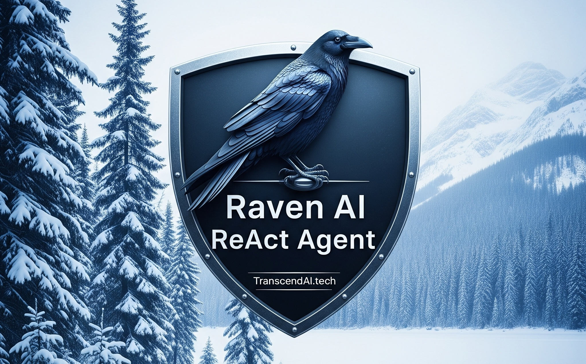

# SwarmCPU
A particle swarm optimization algorithm. 
 
Pure C#, no binaries. No dependencies except for Microsoft's unit testing.
 
[Code Guide](CodeGuide.md) 
 
SwarmCPU is free for non-commercial use, free to test. You need a commercial license to use it commercially. A commercial license is $50 Canadian. 
[Non-commercial license.](License.txt) 
[Commercial license, purchasing info.](https://transcendai.tech/paylanding.html) 
 
SwarmCPU was built with Raven. Raven is an autonomous AI ReAct agent with first class C# code generation support. 
[Raven, 10x coder = 1/10 cost.](https://transcendai.tech) 

 
Copyright [TranscendAI.tech](https://TranscendAI.tech) 2025. 
Authored by Warren Harding. AI assisted. 
